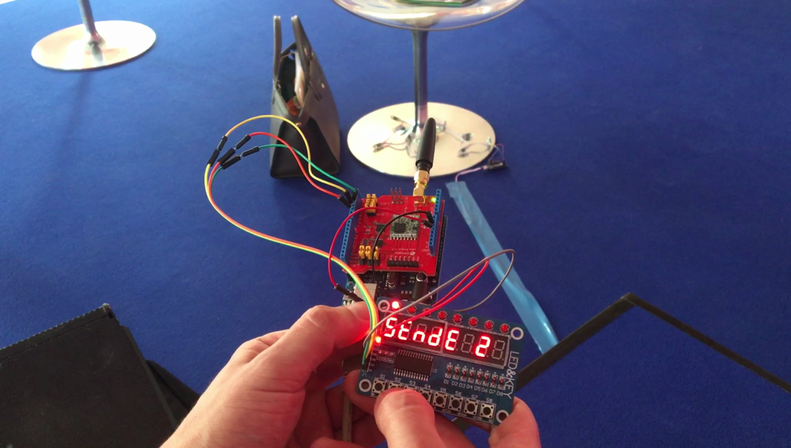
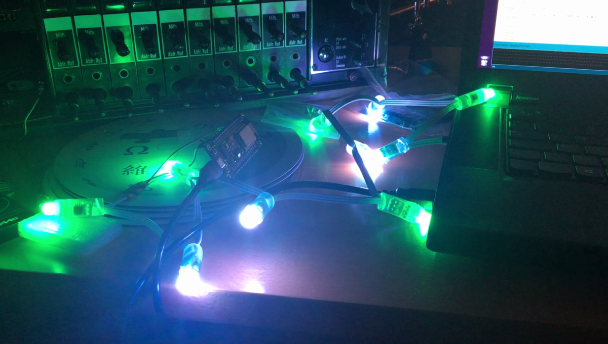

# nodemcu-MQTT

This is an example of how to trigger devices over LoRaWAN/The Things Network. The setup consists of two designs:

 * A handheld sender that looks scarily like some detonation device
 * A NodeMCU-based receiver node that switches a WS2801 LED chain on or off whenever it is triggered through TTN

The principal idea of the design was to place a button board at a scenic view on a hill (i.e., no WiFi connection there) where one can press buttons corresponding with landmark buildings. Those landmark buildings would then reward the button-presser with the illumination of a bright signal light directed at the presser's location. Don't ask how we intend to install those lights yet, the idea counts ;)

## BOM and assembly

For the sender, something that speaks Arduino and TTN, e.g.:

 * Arduino Uno 
 * [Dragino LoRa Shield](http://wiki.dragino.com/index.php?title=Lora_Shield)
 * SMA Rubberduck Antenna
 * TM1638 LED and Key Module
 * Some DuPont wires

Assembly is as easy as plugging in the shield and connecting the TM1638 board with 5V, GND and digital pins 3, 4 and 5.

 For the receivers:

  * NodeMCU (Or WeMos D1, or anything ESP8266-based)
  * Adressable WS2801 LED Pixels
  * DuPont wires
  
  Assembly requires soldering the DuPont wires to the VCC, GND and data wires of the LED chain, and connecting them to the VU, GND and RX (#3) pins of the NodeMCU.